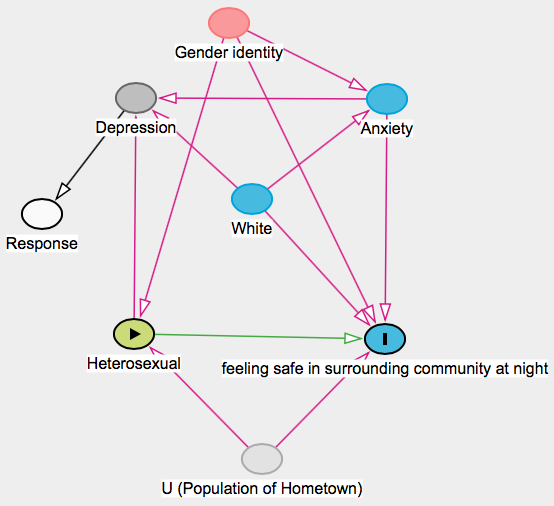

```{r}
#load required packages
library(foreign)
library(ggplot2)
library(dplyr)
library(pcalg)

#read in data
acha_mac <- read.spss("/Users/colleenminnihan/Documents/causal inference/mac_health_2019.SAV", to.data.frame = TRUE)

#check dimensions of dataset
dim(acha_mac)
```
#Causal DAG


```{r}
#clean data
acha_mac_clean <- acha_mac %>%
  select(RNQ47C, RNQ48, NQ7D, NQ7B, NQ56, NQ54A, NQ32, NQ31A2, RNQ47B) %>%
  filter(!is.na(RNQ47C)) %>%
  filter(!is.na(RNQ48)) %>%
  filter(!is.na(NQ7D)) %>%
  filter(!is.na(NQ7B)) %>%
  filter(!is.na(NQ56)) %>%
  filter(!is.na(NQ54A)) %>%
  filter(!is.na(NQ32)) %>%
  filter(!is.na(NQ31A2)) %>%
  rename('Sexual_orientation' = RNQ48, 'Gender_identity' = RNQ47C,'safe_in_community_nighttime' = NQ7D, 'safe_on_campus_nighttime' = NQ7B, 'relationship_status' = NQ56, 'White' = NQ54A, 'Depression_diagnosis' = NQ32, 'Anxiety_diagnosis' = NQ31A2, 'Trans' = RNQ47B) %>%
  mutate(Heterosexual = ifelse(Sexual_orientation == 'Straight/Heterosexual', 1, 0), White = ifelse(White == 'WHITE', 1, 0), Anxiety_diagnosis = ifelse(Anxiety_diagnosis == 'No', 0, 1), Depression_diagnosis = ifelse(Depression_diagnosis == "No",0, 1), binary_safe_in_community1 = ifelse(safe_in_community_nighttime == 'Very safe', 'Yes', 'No'), binary_safe_in_community2 = ifelse(safe_in_community_nighttime == 'Very safe' | safe_in_community_nighttime == 'Somewhat safe', 'Yes', 'No')) %>% #1 = straight, 0 = not straight
  mutate(binary_safe_in_community1 = ifelse(binary_safe_in_community1 == "Yes", 1,0)) #1 = white, 0 = nonwhite
```
#Exploratory Visualizations
```{r}
#diagnosed w/ depression (did not include in blog post draft)
ggplot(acha_mac_clean, aes(x = as.factor(Depression_diagnosis))) + 
  geom_bar() +
  ggtitle("Previous Depression Diagnosis") +
  scale_x_discrete(labels = c("No", "Yes")) +
  xlab("Diagnosis") +
  ylab("Number of People")

#diagnosed w/ anxiety (did not include in blog post draft)
ggplot(acha_mac_clean, aes(x = as.factor(Anxiety_diagnosis))) + 
  geom_bar() +
  ggtitle("Anxiety Diagnosis or Treatment (past 12 months)") +
  scale_x_discrete(labels = c("No", "Yes")) +
  xlab("Diagnosis or Treatment") +
  ylab("Number of People")

#gender identity (did not include in blog post draft)
ggplot(acha_mac_clean, aes(x = Gender_identity)) + 
  geom_bar() +
  theme(axis.text.x = element_text(angle = 90)) +
  ggtitle("What is your Gender Identity?")+
  xlab("Identity") +
  ylab("Number of People")

#trans (did not include in blog post draft)
ggplot(acha_mac_clean, aes(x = Trans)) + 
  geom_bar() +
  ggtitle("Do you Identify as Transgender?") +
  xlab("Transgender") +
  ylab("Number of People")

#Sexual orientation
ggplot(acha_mac_clean, aes(x = Sexual_orientation)) + 
  geom_bar(fill = "mediumpurple") +
  ggtitle("What is your Sexual Orientation?") +
  xlab("Sexual Orientation") +
  ylab("Number of People") +
  theme(axis.text.x = element_text(angle = 90))

#sexual orientation binary
ggplot(acha_mac_clean, aes(x = as.factor(Heterosexual))) + 
  geom_bar(fill = "mediumorchid2") +
  ggtitle("Are you Heterosexual?") +
  xlab("Heterosexual") +
  ylab("Number of People") +
  scale_x_discrete(labels = c("No", "Yes")) 

#how safe do you feel in the community around campus at night (did not include in blog post draft)
ggplot(acha_mac_clean, aes(x = safe_in_community_nighttime)) + 
  geom_bar() +
  ggtitle("How safe do you feel in the Surrounding Community at Night?") +
  xlab("Perceived Safety") +
  ylab("Number of People")

#binary safe in community (with yes being only those who said "very safe")
ggplot(acha_mac_clean, aes(x = as.factor(binary_safe_in_community1))) + 
  geom_bar(fill = "mediumpurple4") +
  ggtitle("Perceived Safety in Community Surrounding Campus at Night (Yes/No)") +
  xlab("Feel Safe") +
  ylab("Number of People") +
  scale_x_discrete(labels = c("No", "Yes"))

#white race (did not include in blog post draft)
ggplot(acha_mac_clean, aes(x = as.factor(White))) + 
  geom_bar() +
  ggtitle("White Race") +
  xlab("White") +
  ylab("Number of People") +
  scale_x_discrete(labels = c("No", "Yes")) 
```

#Sensitivity Analysis
```{r}
set.seed(451)
sensitivity_analysis <- function(.data, model_A, model_Y, assoc_A, assoc_Y) {
    n <- nrow(.data) #takes dataset as input, needs models for A and Y, two sensitivity parameters for U to Y and U to A

    # Obtain residuals with residuals()
    # Obtain residual variances with sigma()
    res_A <- residuals(model_A)
    res_var_A <- sigma(model_A)^2
    res_Y <- residuals(model_Y)
    res_var_Y <- sigma(model_Y)^2

    # Compute the mean and variance of U given A and Y
    mean_U_term1 <- (assoc_A/res_var_A)*res_A
    mean_U_term2 <- (((res_var_A - assoc_A^2)*assoc_Y)/(res_var_A*res_var_Y))*res_Y
    mean_U <- mean_U_term1 + mean_U_term2

    var_U_term1 <- (res_var_A - assoc_A^2)/(res_var_A*res_var_Y)
    var_U_term2 <- res_var_Y - assoc_Y^2 + ((assoc_A*assoc_Y)^2)/res_var_A
    var_U <- var_U_term1*var_U_term2 #must be positive

    # Simulate U and add it to the data
    U <- rnorm(n, mean = mean_U, sd = sqrt(var_U))
    .data$U <- U

    ########################################################################
    # The part below is the only part you need to change to implement
    # the sensitivity analysis in a new context.

    # Refit model to estimate the causal effect 
    updated_model <- lm(binary_safe_in_community1 ~ Heterosexual + White + Depression_diagnosis + Anxiety_diagnosis + Gender_identity + U, data = .data)
    # The names of the coefficients and confidence interval output rows
    # are called "A" for the treatment variable A.
    # This will change in a new dataset.
    list(c(
        estimate = unname(coefficients(updated_model)["Heterosexual"]), 
        ci_95_lower = confint(updated_model)["Heterosexual",1],
        ci_95_upper = confint(updated_model)["Heterosexual",2]
    ))
} #so you can contain the three numerical pieces of info together in one thing/case

# Begin the sensitivity analysis

# Fit required models for the sensitivity analysis
mod_A <- lm(Heterosexual ~ Gender_identity, data = acha_mac_clean) #how A depends on the confounders
mod_Y <- lm(binary_safe_in_community1 ~ Heterosexual + Gender_identity, data = acha_mac_clean) #our wrong model that ignored the potential unmeasured confounder

summary(mod_Y)

# Set up degree of association between U and A and between U and Y
# The U->A associations have some constraints: we set up values 
# for the U->A associations that are at most equal to the
# standard deviation of the residuals from the model for A.
U_A_assocs <- seq(from = -0.1, to = sigma(mod_A), length.out = 10)
U_Y_assocs <- seq(from = 0.01, to = sigma(mod_Y), by = 0.1) #look at summary output of mod_Y to determine these values, we want the association to be same sign as A -> Y

# Form all combinations of the U->A and U->Y sensitivity parameters
sens_data <- expand.grid(U_A = U_A_assocs, U_Y = U_Y_assocs)

# Run sensitivity analysis
sens_data <- sens_data %>%
    group_by(U_A, U_Y) %>%
    mutate(sens = sensitivity_analysis(acha_mac_clean, mod_A, mod_Y, U_A, U_Y))
# Collect sensitivity analysis results in a data.frame
sens_data <- bind_cols(sens_data[,1:2], bind_rows(sens_data$sens))


# Plot results
prepender <- function(string, prefix = "U -> Y strength:") paste(prefix, string)

ggplot(sens_data, aes(x = U_A, y = estimate)) +
    geom_ribbon(aes(ymin = ci_95_lower, ymax = ci_95_upper), fill = "grey70") +
    geom_line() +
    geom_hline(aes(yintercept = coefficients(mod_Y)["A"]), color = "blue", lty = "dashed") +
    geom_hline(aes(yintercept = 0), color = "blue") +
    facet_wrap(~U_Y, labeller = as_labeller(prepender)) +
    labs(x = "Strength of U -> A association", y = "ACE and 95% CI") +
    geom_hline(aes(yintercept = 0.08920), color = "red") #this is the original ACE of the model that doesn't account for unmeasured variables
```

#Interaction Term Plots
```{r}
#checking for interaction between gender identity and heterosexual
ggplot(acha_mac_clean, aes(x = as.factor(Heterosexual), fill = as.factor(binary_safe_in_community1))) +
    geom_bar(position = "fill") +
    facet_grid(~Gender_identity) +
  labs(fill = "Feels Safe") +
  xlab("Heterosexual") +
  ylab("Probability") +
  ggtitle("Gender Identity and Heterosexuality Interaction Term Plot")

#checking for interaction between trans identity and heterosexuality (did not include in blog post draft)
ggplot(acha_mac_clean, aes(x = as.factor(Heterosexual), fill = as.factor(binary_safe_in_community1))) +
    geom_bar(position = "fill") +
    facet_grid(~Trans)
```

#Making the models
```{r}
#linear model
safetyACEoverall <- lm(binary_safe_in_community1 ~ Heterosexual + Gender_identity + Anxiety_diagnosis + White, data = acha_mac_clean) #corresponds to sensitivity
summary(safetyACEoverall)

#linear model with interaction term
safetyACEsubgroup <- lm(binary_safe_in_community1 ~ Heterosexual + Gender_identity + Anxiety_diagnosis + White + Heterosexual:Gender_identity, data = acha_mac_clean) #corresponds to sensitivity
summary(safetyACEsubgroup)

#generalized linear model (because of the binary response)
safetyACEmod2 <- glm(binary_safe_in_community1 ~ Heterosexual + Gender_identity + Anxiety_diagnosis + White, data = acha_mac_clean, family = "binomial")
summary(safetyACEmod2)

#linear model with trans variable instead of gender identity
mod_withtrans <- lm(binary_safe_in_community1 ~ Heterosexual + Trans, data = acha_mac_clean) #corresponds to sensitivity
summary(mod_withtrans)
```